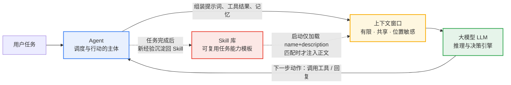
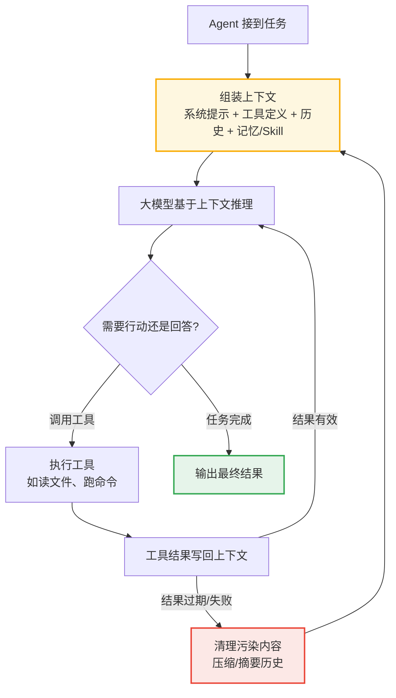
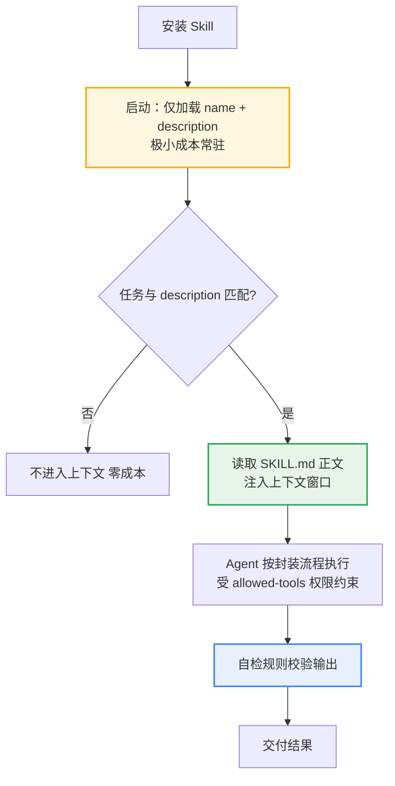
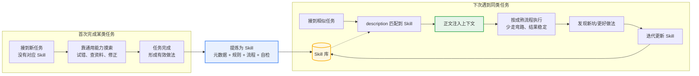

# Agent、大模型上下文、Skill 三者关系

> 生成日期：2026-09-09
> 本文是三份概念学习资料的横向总结，详细展开见：[Agent-Skill.md](learning-materials/Agent-Skill.md)（Anthropic 的 Skill 格式规范）、[大模型上下文.md](learning-materials/大模型上下文.md)（上下文机制）、[Skill.md](learning-materials/Skill.md)（Skill 通用概念）。

## 一句话定位

- **大模型（LLM）**：推理引擎，负责理解、决策和生成，但它"每次醒来都是失忆的"。
- **上下文（Context）**：模型生成每一个字时能"看见"的全部内容，是一块**有限、共享、位置敏感的"桌面空间"**——系统提示、对话历史、检索文档、工具结果全都要挤在这张桌子上竞争。
- **Skill**：为 Agent 封装的**可复用任务能力模板**——把任务流程、规则提前写进文件固化，触发时才注入上下文，"用到才翻开的专业操作手册"。

三者的核心关系可以概括为一句话：

> **Agent 以大模型为大脑，以上下文为短期工作内存，以 Skill 为可插拔的技能库。**

---

## 重点一：大模型的上下文如何影响 Agent 的工作

大模型没有持久记忆——它不查数据库、不翻笔记，每一步只依据窗口里的内容作答。所以 Agent 的每一次决策质量，几乎完全取决于**当时上下文里装了什么**。影响体现在四个层面：

### 1. 上下文 = Agent 的"视野边界"

Agent 只能基于上下文中出现的信息做判断。文件没读进来、规则没写进提示词、历史没注入——对 Agent 而言就等于**不存在**。同一个模型，窗口里是详细资料还是空白，表现判若两人：Agent 的能力上限不是"模型会不会"，而是"上下文里有没有"。

### 2. 上下文的组成决定行为的稳定性

| 上下文组成 | 内容 | 对行为的影响 |
|---|---|---|
| 系统提示词 | 角色设定、行为规则、边界约束 | 定基调，决定"它认为自己是谁" |
| 工具定义 | 可用工具的名称与参数说明 | 决定"它能做什么、会不会正确调用" |
| 对话历史 | 之前的轮次与工具返回结果 | 决定"它记得什么、是否连贯" |
| 注入的记忆/文档 | 长期记忆、项目约定、Skill 正文 | 决定"它懂不懂这个项目的规矩" |

### 3. 窗口的三条性质直接决定 Agent 的失效模式

- **有限 → 膨胀与遗忘**：四类内容竞争同一空间，塞入过多无关信息后注意力被摊薄（context rot），对关键指令的遵从度下降，"看不见明确写着的规则"；长任务中早期信息被挤出窗口，Agent 会重复已做过的事。
- **共享 → 污染**：过期的工具输出、失败的尝试、错误的中间结论留在窗口里，会持续误导后续每一步决策——多塞一段文档，就多挤占一分注意力。
- **位置敏感 → 中间被忽略**：开头与结尾记得牢，中间易被忽略（[Lost in the Middle](https://arxiv.org/abs/2307.03172) 的实证结论）——关键规则放在长上下文中段等于没写。

因此 **Agent 工程的核心就是上下文工程**：决定什么信息、在什么时机、以什么形式、放在什么位置进入上下文，以及何时清理过期内容。正确姿势是用**最小的、高信号的 token 集合**达成目标，而非拼命塞满窗口。

### 4. 反馈闭环：上下文质量 → 决策质量 → 行动结果

---

## 重点二：Skill 如何沉淀可复用的任务知识

### 1. 解决的问题：经验无法靠上下文传承

上下文是单次请求的工作内存，跨会话不保留任何内容。如果"生成一份概念学习资料要哪几步、来源怎么核实、红线是什么"只存在于某次对话里，下次任务还得从零摸索、重复粘贴大段提示词。Skill 的本质是**把"怎么做事"的方法论从对话中抽出来，固化为可重复加载的知识单元**。

### 2. Skill 的四层结构：让经验可被机器执行

| 层 | 内容 | 作用 |
|---|---|---|
| 元数据头部 | YAML frontmatter：name、description、allowed-tools | description 决定何时触发；工具白名单限定权限 |
| 角色与规则定义 | 身份、适用场景、输入输出格式与约束 | 规定"做什么、做到什么程度" |
| 执行步骤流程 | 标准化操作流水线 | 把个人经验变成标准流程 |
| 自检规则 | 完成后的校验清单 | 保证每次输出质量稳定 |

**本仓库的 `concept-material-generator` 就是一个活样本**：`.workbuddy/skills/concept-material-generator/SKILL.md` 把"生成概念学习资料"这件事固化为八步流程（解析概念 → 索引查重 → 源头查证 → 筛选来源 → 撰写 → 更新索引 → 自检 → 汇报）加硬性红线（禁止编造链接）。`learning-materials/` 里的三份资料都是它生成的——经验写一次，此后每次调用不再依赖任何人的记忆。

### 3. 按需注入：Skill 本身就是一套上下文管理策略

Skill 与上下文的配合方式（渐进式披露）直接回应了重点一的约束：

- 启动时只有 name + description 常驻，不挤占窗口；
- 匹配到任务才注入正文，相当于"用到才翻开的专业操作手册"；
- **边界**：Skill 不是越长越好——触发后全部内容加载进窗口，写得冗长会挤占空间、稀释注意力，反而导致任务出错。正确做法是精简高信号内容，细节放附件按需读取。

### 4. 沉淀与复用的闭环

### 5. Skill 与记忆、提示词的分工

| | Skill | 记忆（Memory） | 普通提示词 |
|---|---|---|---|
| 沉淀内容 | **怎么做**：流程、规则、决策 | **发生过什么**：事实、偏好、约定 | 当次的指令 |
| 生命周期 | 存为文件固化，反复加载 | 跨会话持久 | 对话结束即失效 |
| 触发方式 | Agent 按 description 自动匹配 | 按需检索或会话开始时注入 | 用户手动输入 |
| 权限 | 有工具调用白名单 | 无独立权限 | 无独立权限 |
| 价值 | 行为**可复制、稳定** | 决策**有依据、连贯** | 灵活但不可复用 |

---

## 小结

- **大模型**是推理引擎，但只有一次性的"视野"；
- **上下文**是这次推理的全部输入——有限、共享、位置敏感，它的质量直接决定 Agent 决策的质量，所以 Agent 工程的核心是上下文工程；
- **Skill** 把验证过的做事方法固化为四层结构的可插拔能力模板，通过"启动只装元数据、匹配才注入正文"的渐进式披露与上下文约束达成平衡，让 Agent 从"每次重新摸索"进化为"拿来即用的稳定执行"。

三者合起来构成一个增长型系统：**上下文决定当下表现，Skill 决定长期复利**——本仓库的 `concept-material-generator` 与它生成的三份学习资料，正是这套关系的一个完整实例。
