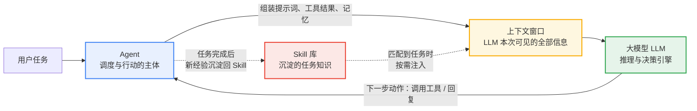
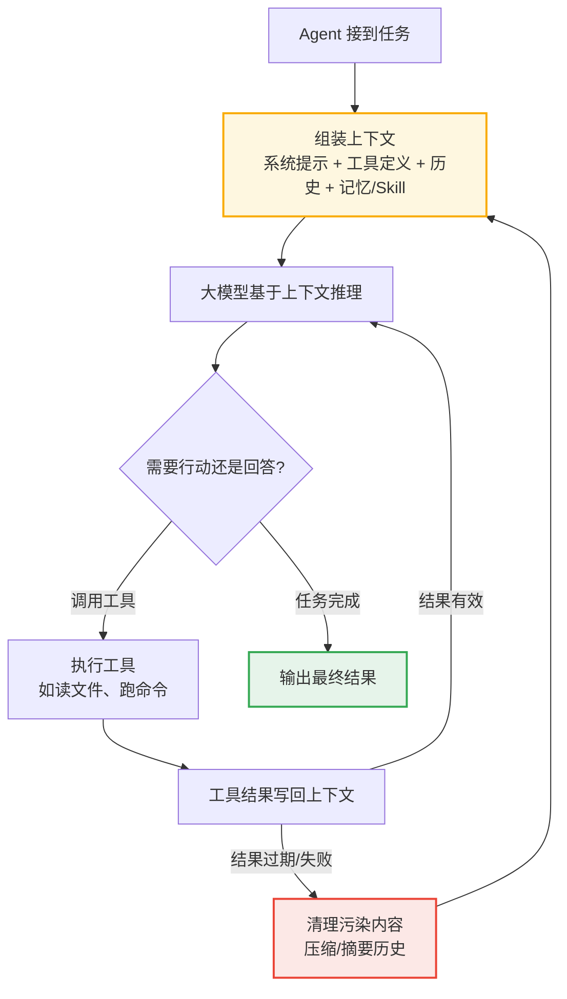
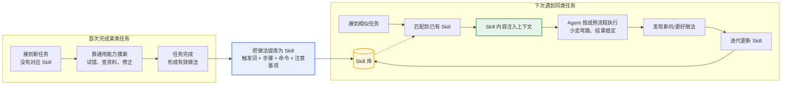

# Agent、大模型上下文、Skill 三者关系

## 一句话定位

- **大模型（LLM）**：推理引擎，负责理解、决策和生成，但它"每次醒来都是失忆的"。
- **上下文（Context）**：大模型当前这一次推理能"看见"的全部信息，是 Agent 的**工作内存**。
- **Skill**：把某类任务的做法沉淀成**可复用的指令包**，在需要时按需注入上下文，是经验的外置存储。

三者的核心关系可以概括为一句话：

> **Agent 以大模型为大脑，以上下文为短期记忆，以 Skill 为可插拔的技能库。**

---

## 重点一：大模型的上下文如何影响 Agent 的工作

大模型没有持久记忆，Agent 的每一次决策质量，几乎完全取决于**当时上下文里装了什么**。上下文对 Agent 的影响体现在四个层面：

### 1. 上下文 = Agent 的"视野边界"

Agent 只能基于上下文中出现的信息做判断。文件没读进来、规则没写进提示词、历史没注入——对 Agent 而言就等于**不存在**。这决定了 Agent 的能力上限：不是"模型会不会"，而是"上下文里有没有"。

### 2. 上下文的组成决定行为的稳定性

典型的 Agent 上下文由多块拼接而成，每一块都直接影响输出：

| 上下文组成 | 内容 | 对行为的影响 |
|---|---|---|
| 系统提示词 | 角色设定、行为规则、边界约束 | 定基调，决定"它认为自己是谁" |
| 工具定义 | 可用工具的名称与参数说明 | 决定"它能做什么、会不会正确调用" |
| 对话历史 | 之前的轮次与工具返回结果 | 决定"它记得什么、是否连贯" |
| 注入的记忆/文档 | 长期记忆、项目约定、Skill 内容 | 决定"它懂不懂这个项目的规矩" |

### 3. 上下文污染与膨胀是 Agent 失效的主因

- **污染**：过期的工具输出、失败的尝试、错误的中间结论留在上下文里，会持续误导后续每一步决策。
- **膨胀**：上下文窗口有限且注意力会稀释，塞入过多无关信息后，模型对关键指令的遵从度下降，出现"看不见明确写着的规则"。
- **遗忘**：长任务中早期信息被挤出或淡化，Agent 会重复已做过的事、丢失早期约束。

因此 Agent 工程在很大程度上就是**上下文工程**：决定什么信息、在什么时机、以什么形式进入上下文，以及何时清理过期内容。

### 4. 反馈闭环：上下文质量 → 决策质量 → 行动结果

---

## 重点二：Skill 如何沉淀可复用的任务知识

### 1. 解决的问题：经验无法靠上下文传承

Agent 每次会话的上下文都是临时的。如果"部署一个项目要哪几步、踩过什么坑"只存在于某次对话里，下次任务还得从零摸索。Skill 的本质是**把"怎么做事"的方法论从对话中抽出来，固化为可重复加载的知识单元**。

### 2. Skill 的结构：触发条件 + 稳定的操作指引

一个 Skill 通常包含两类信息：

- **触发条件（Trigger）**：什么任务、什么关键词出现时应该加载我——让 Agent 能自动判断"该用哪个技能"。
- **操作指引（Playbook）**：经过验证的步骤、命令、参数、注意事项、决策规则——把个人经验变成标准流程。

### 3. 按需注入：不占常驻上下文

Skill 平时躺在库里，**只在匹配到任务时才被加载进上下文**。这一点很关键：

- 它不像系统提示词那样常驻挤占窗口；
- 又不像普通对话历史那样转瞬即逝；
- 相当于给大模型装了一套"用到才翻开的操作手册"。

### 4. 沉淀与复用的闭环

### 5. Skill 与记忆的分工

| | Skill | 记忆（Memory） |
|---|---|---|
| 沉淀内容 | **怎么做**：流程、命令、决策规则 | **发生过什么**：事实、偏好、项目约定 |
| 形态 | 结构化指令包 | 日志或摘要 |
| 加载方式 | 任务匹配时整体注入 | 按需检索或会话开始时注入 |
| 价值 | 让行为**可复制、稳定** | 让决策**有依据、连贯** |

---

## 小结

- **大模型**是推理引擎，但只有一次性的"视野"；
- **上下文**是这次推理的全部输入，它的质量直接决定 Agent 决策的质量——上下文工程就是 Agent 工程的核心；
- **Skill** 把验证过的做事方法固化为可插拔的知识单元，按需注入上下文，让 Agent 从"每次重新摸索"进化为"拿来即用的稳定执行"。

三者合起来构成一个增长型系统：**上下文决定当下表现，Skill 决定长期复利。**
