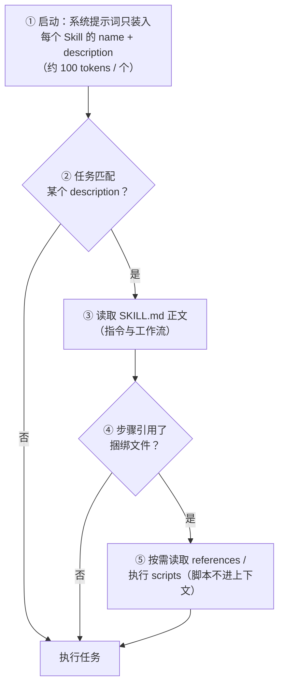

# Agent Skill

> 概念学习资料 · 生成日期：2026-09-06 · 生成工具：concept-material-generator

## 1. 概念个人解释

Agent Skill 是给 AI 智能体的一份"新员工入职手册"：一个文件夹，装着指令、脚本和资源。智能体平时只记住每本手册的目录，到相关任务时需要才翻开细读。

它解决的问题：通用模型懂原理，你不懂的流程。品牌规范、代码审查清单、PDF 表单填写步骤——过去每次对话都要重新解释，现在打包一次，处处复用。

一句话本质：**用文件夹而非代码，把专业知识"挂"到智能体身上。**

## 2. 核心机制或组成

一个 Skill 就是一个目录，唯一必需的文件是 `SKILL.md`：

`SKILL.md` 开头的 YAML frontmatter 必填两个字段：

```yaml
---
name: pdf-processing
description: 提取 PDF 文本、填写表单。用户提到 PDF 或表单时使用。
---
```

核心机制是**渐进式披露（progressive disclosure）**——按需加载，控制上下文成本：



官方定义的四个特性，一句话一个：

- **可组合**：多个 Skill 自动叠加协同
- **可移植**：同一格式跨 Claude 应用 / Claude Code / API，2025-12 起为开放标准
- **高效**：只在需要时加载需要的内容
- **强大**：可含可执行代码——精确操作交给确定性代码，不靠 token 生成

## 3. 具体应用场景

1. **文档处理**：Anthropic 官方 pdf / docx / pptx / xlsx Skill，用捆绑脚本填表单、算公式——脚本直接执行，不占上下文。
2. **组织知识复用**：品牌规范、格式标准打包成 Skill，Claude 每次生成内容自动遵循，无需重复交代。
3. **团队工作流共享**：Claude Code 中通过版本控制共享 Skill，成员放入 `~/.claude/skills` 即生效。
4. **跨平台迁移**：格式已成开放标准，GitHub Copilot、Cursor、Gemini CLI、OpenAI Codex 等 30+ 工具通用。

## 4. 容易混淆的问题或使用边界

| 对比项  | Agent Skill   | MCP              |
| ---- | ------------- | ---------------- |
| 本质   | 装专业知识的**文件夹** | 连接外部系统的**协议**    |
| 解决   | "怎么做"（流程、规范）  | "连什么"（数据源、工具接口）  |
| 形态   | 静态文件，按需读取     | 运行时连接，实时调用       |
| 典型例子 | 品牌规范、文档处理流程   | 接数据库、调用 SaaS API |

**Skill ≠ 微调 / RAG**：不改模型权重，不建向量库，只是智能体按需读取的文件。零训练成本换来"知道流程"，不是"学会新知识"。

使用边界：

- 是否触发由智能体依据 description 判断——描述含糊，Skill 就永远不会被用上
- 执行捆绑脚本需要代码执行环境支持
- 动态、实时的外部数据连接应该用 MCP，不是 Skill

## 5. 可核查资料来源链接

1. [Introducing Agent Skills — Anthropic 官方发布博客](https://claude.com/blog/skills)：2025-10-16 的原始出处，定义、四大特性与开放标准更新的一手陈述。
2. [Equipping agents for the real world with Agent Skills — Anthropic 工程博客](https://www.anthropic.com/engineering/equipping-agents-for-the-real-world-with-agent-skills)：技术深潜，渐进式披露三层机制的原始出处。
3. [agentskills.io — 开放标准官网](https://agentskills.io)：2025-12-18 发布的开放标准，格式定义与采用方一览。
4. [anthropics/skills — GitHub 仓库](https://github.com/anthropics/skills)：官方示例 Skill 集合，可直接阅读真实结构。

## 6. 自测题

**Q1（识别）** 一个 Skill 目录中唯一必需的文件是什么？其 YAML frontmatter 必填哪两个字段？

<details><summary>答案</summary>

`SKILL.md`；必填 `name` 与 `description`。
</details>

**Q2（理解）** 为什么启动时只把每个 Skill 的 name + description 装入系统提示词，而不是把所有 Skill 全文塞进去？

<details>

<summary>上下文窗口有限且昂贵。渐进式披露让几十个 Skill 常驻成本只有每条约 100 tokens，正文与捆绑文件只在任务匹配时才加载。</summary>

</details>

**Q3（应用）** 你的团队每次都要向智能体重复交代："周报用 X 模板生成，标题格式为「部门-第 N 周」，数据从 data/ 目录取。"请设计一个最小可用的 Skill 结构。

<details>

<summary>要点：把"何时使用"写进 description，模板作为 assets 捆绑，正文保持精简。</summary>

```
weekly-report/
├── SKILL.md      # frontmatter 写清 name 和触发时机；
│                 # 正文写标题格式与数据来源约定
└── assets/
    └── X.docx   # 周报模板
```

</details>

**Q4（辨析）** 两个需求分别该用 Skill 还是 MCP？为什么？(a) 让智能体每次代码审查都执行团队 12 条检查清单；(b) 让智能体能实时查询公司内部数据库。

<details>

<summary>(a) Skill——静态流程知识，打包成文件夹按需加载即可。(b) MCP——需要运行时实时连接外部数据源；Skill 只是文件，没有连接能力。</summary>

</details>
