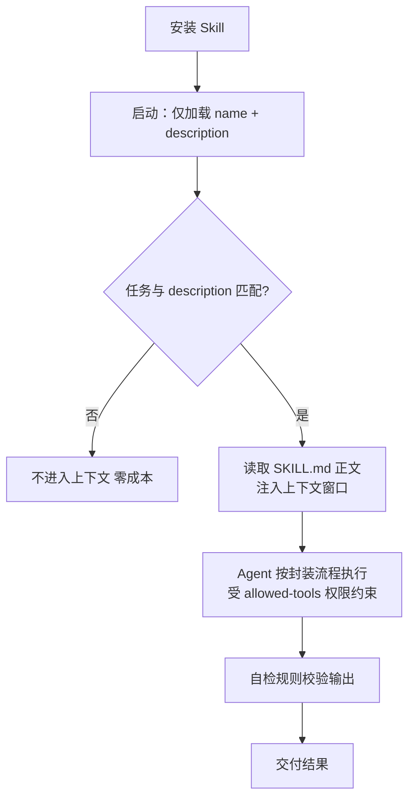

# Skill

> 概念学习资料 · 生成日期：2026-09-09 · 生成工具：concept-material-generator
>
> 概念语境：本文取 AI Agent 领域的通用含义——为 Agent 封装的可复用任务能力模板。Anthropic 的具体格式规范（Agent Skills 标准）另见 [Agent-Skill.md](Agent-Skill.md)。

## 1. 概念个人解释

Skill 是为 Agent 封装沉淀出来的**可复用任务能力模板**。很多任务会反复执行，如果每次都把完整要求写进提示词，既麻烦又占用大量上下文——所以 Skill 把任务流程、规则提前封装好，Agent 需要时直接加载调用，不用重复编写指令。

一句话本质：**任务能力的封装复用载体。** 它和上下文的关系（[大模型上下文.md](大模型上下文.md)）：Skill 平时躺在库里不占空间，触发时才注入上下文窗口——"用到才翻开的专业操作手册"。

## 2. 核心机制或组成

一个 Skill 的四层结构：

1. **元数据头部**：YAML frontmatter，定义 name（名字）、description（触发描述）、allowed-tools（工具权限白名单，如 Read、Write）
2. **角色与规则定义**：规定 Skill 的身份、适用场景、输入输出格式与约束
3. **执行步骤流程**：标准化操作流水线，收到输入后分几步完成工作
4. **自检规则**：完成后的校验标准，检查输出是否符合要求

工作机制与生命周期：

## 3. 具体应用场景

1. **项目级作业开发**：把概念学习资料生成逻辑封装为项目 Skill（即本仓库的 concept-material-generator），输入任意 AI 概念，自动输出规范 Markdown 笔记——本文档正是它生成的。团队任何人打开仓库即可复用，不用重复写大段提示词。
2. **代码辅助 Agent**：封装代码检查 Skill，定义代码格式与检查规则，Agent 收到代码文件自动执行格式校验、找 bug。统一审查标准，每次调用不重复粘贴要求。
3. **文档处理助手**：封装文档摘要 Skill，规定摘要输出结构与字数，Agent 拿到长文档直接调用。输出格式始终统一，减少重复提示词的上下文开销。

## 4. 容易混淆的问题或使用边界

**Skill vs 普通提示词**

| | Skill | 普通提示词 |
|---|---|---|
| 生命周期 | 存为文件固化，反复加载 | 一次性指令，对话结束即失效 |
| 权限 | 拥有工具调用白名单 | 无独立权限 |
| 触发 | Agent 按任务自动匹配 | 用户手动输入 |

**Skill vs 记忆（Memory）**

| | Skill | 记忆 |
|---|---|---|
| 沉淀内容 | 怎么做：流程、规则、决策 | 发生过什么：事实、偏好、约定 |
| 价值 | 行为可复制、稳定 | 决策有依据、连贯 |

**使用边界**：Skill 不是万能的——它的全部内容会加载进上下文窗口，写得过于冗长复杂，会挤压 Agent 可用记忆空间，造成任务出错。

## 5. 可核查资料来源链接

1. [WorkBuddy（CodeBuddy Code）官方文档 — Skills 功能](https://cloud.tencent.com/document/product/1831/137020)：SKILL.md 文件结构、frontmatter 字段（name / description / allowed-tools）、项目级与用户级组织方式的一手规范。
2. [Introducing Agent Skills — Anthropic 官方博客](https://claude.com/blog/skills)：Anthropic 2025-10-16 首发公告，Skill 作为可组合、可移植、按需加载的能力包的设计思想源头。
3. [agentskills.io — Agent Skills 开放标准](https://agentskills.io)：Skill 的最小格式规范（文件夹 + SKILL.md，必填 name 与 description）及跨平台采纳情况。

## 6. 自测题

**识别**

1. 下面哪一项是 Skill 的核心特点？
   A. 可以独立思考执行任务
   B. 封装可复用任务流程，供 Agent 调用
   C. 等同于大模型本身
   D. 只可以全局使用，不能放在项目内

答案

B。Skill 是任务能力封装，本身不能独立思考；且可以做项目级 Skill（如本仓库的 concept-material-generator）。

**理解**

2. Skill 为什么能够减少重复写提示词的工作？

答案

Skill 把任务规则、步骤提前写进文件固化，Agent 直接读取 Skill 文件执行；用户不需要每次聊天重复输入全套要求。

**应用**

3. 如果你需要反复做"生成概念学习笔记"这件事，要不要封装成 Skill？说明理由。

答案

要。任务重复执行，封装后统一输出格式、避免每次复制大段提示词；项目级 Skill 还可跟随仓库共享给团队——本仓库已用 concept-material-generator 实践了这一点。

**辨析**

4. 判断：Skill 写得越长越详细越好，不用担心上下文。

答案

错误。Skill 触发后全部内容加载进上下文窗口，内容过长会挤占空间、稀释注意力，导致 Agent 丢失信息、任务失败。正确做法是精简高信号内容，细节放附件按需读取。

