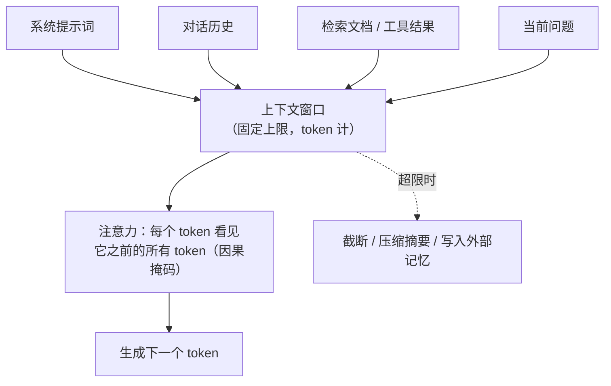

# 大模型上下文

> 概念学习资料 · 生成日期：2026-09-06 · 生成工具：concept-material-generator

## 1. 概念个人解释

大模型上下文（context），就是模型在生成每一个字时**能"看见"的全部内容**；上下文窗口（context window），是这块"工作记忆"的大小上限，以 token 计数。

模型不查数据库、不翻笔记——它每一步只依据窗口里的内容作答。所以同一个模型，窗口里是详细资料还是空白，表现判若两人。

一句话本质：**一块有限的、所有信息共享的"桌面空间"——系统提示、对话历史、检索文档、工具结果，全都要挤在这张桌子上竞争。**

## 2. 核心机制或组成

窗口里装什么、装满之后怎么办：

三条关键性质，每条一句话：

- **有限**：超限必须截断、压缩或外存，没有例外
- **共享**：四类内容竞争同一空间——多塞一段文档，就多挤占一分注意力
- **位置敏感**：开头与结尾记得牢，中间易被忽略（[Lost in the Middle](https://arxiv.org/abs/2307.03172) 的实证结论）

根源在注意力机制：每个 token 要与它之前的所有 token 建立注意力关系，计算量随长度平方增长——窗口越长，"注意力"被摊得越薄（context rot，上下文腐烂）。

## 3. 具体应用场景

1. **RAG 检索增强**：窗口装不下整个文档库，所以先检索、只把相关片段塞进窗口——用"看见"补充"记住"。
2. **长对话续命**：多轮对话逼近上限时压缩历史为摘要（compaction），丢弃冗余的工具输出，对话得以继续。
3. **Agent Skill 的渐进式披露**：[Agent Skill](Agent-Skill.md) 启动只装元数据、按需才读正文——本质就是一套上下文管理策略。
4. **提示缓存**：稳定不变的前缀（系统提示等）可被缓存复用，成本大幅降低——前提是前缀保持稳定。

## 4. 容易混淆的问题或使用边界

| 对比项 | 上下文窗口 | 训练数据（参数化知识） |
|---|---|---|
| 类比 | 桌上摊开的资料（看见） | 脑子里的记忆（记住） |
| 生效期 | 单次请求，结束即消失 | 永久固化在权重里 |
| 改动成本 | 每次请求都能换 | 必须重新训练 |
| 典型误用 | 以为关掉对话模型还记得 | 以为新资料模型"已经学会" |

**窗口 ≠ 记忆**：跨会话不保留任何内容，长期记忆要靠外部存储（文件、数据库）主动写回窗口。

**使用边界**：窗口更长 ≠ 效果更好——信息淹没在中间时召回反而下降；且推理成本随长度增长。正确姿势是**用最小的、高信号的 token 集合达成目标**，而非拼命塞满。

## 5. 可核查资料来源链接

1. [Attention Is All You Need（arXiv:1706.03762）](https://arxiv.org/abs/1706.03762)：Transformer 原始论文（2017），上下文机制的源头——自注意力让每个位置全局可见。
2. [Lost in the Middle（arXiv:2307.03172）](https://arxiv.org/abs/2307.03172)：斯坦福 2023 论文，实证长上下文的位置局限——中间信息召回显著下降。
3. [Effective context engineering for AI agents — Anthropic 工程博客](https://www.anthropic.com/engineering/effective-context-engineering-for-ai-agents)：把上下文当稀缺资源的工程实践，context rot、压缩、子智能体等策略的一手出处。

## 6. 自测题

**Q1（识别）** 上下文窗口以什么为单位？其中通常装着哪几类内容？

答案

以 token 为单位。四类内容：系统提示词、对话历史、检索文档/工具结果、当前问题。

**Q2（理解）** 为什么"窗口更大"不等于"回答更好"？请给出两个原因。

答案

① 位置敏感：中间的信息召回显著下降（Lost in the Middle / context rot）；② 注意力被摊薄：每个 token 与之前 token 的注意力关系数随长度平方增长，长窗口里模型对每段信息的把握下降。另外成本也随长度增长。

**Q3（应用）** 一个多轮对话的 Agent 运行几小时后接近窗口上限、输出质量开始下降。请给出一个可持续的应对方案。

答案

压缩（compaction）：把历史对话总结成摘要、清除已处理完的工具原始输出，用"摘要 + 最近若干轮"重新续接；重要状态（计划、决策）写入外部文件，需要时再读回——而不是无限依赖窗口。

**Q4（辨析）** 两种说法： (a) "把产品手册贴进提示词，模型知道退货政策了" (b) "用产品手册微调后，模型学会退货政策了" —— 哪个改变的是上下文，哪个改变的是参数化知识？各自的生效范围是什么？

答案

(a) 是上下文——仅本次请求生效，下轮不贴就忘；(b) 是参数化知识——永久固化在权重里，但细节弹性差、更新要重新训练。实践中 (a) 适合频繁更新的资料，(b) 适合稳定的行为风格。

